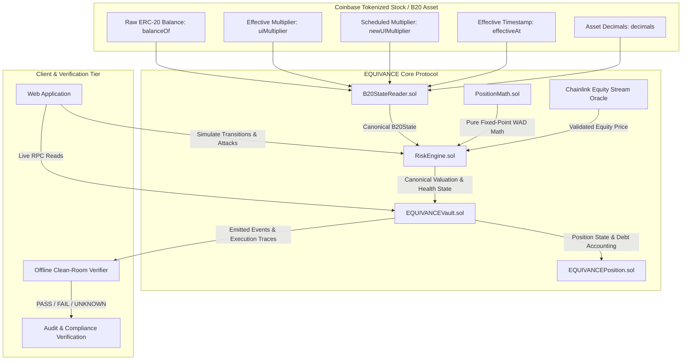

# EQUIVANCE — Architecture Specification

## 1. System Overview
EQUIVANCE is an onchain credit protocol designed specifically for B20/ERC-8056 tokenized equities on Base. The architecture separates raw asset accounting from dynamic UI corporate action multipliers, executing all valuation calculations through a single canonical risk kernel.



## 2. Component Breakdown

### 2.1 `PositionMath.sol`
A stateless, pure mathematical library providing deterministic 18-decimal fixed-point (WAD) arithmetic:
- `valueCollateral(rawTokenAmount, totalReturnPrice8, assetDecimals, oracleDecimals)`: Canonical valuation multiplying raw token units by the Chainlink Total Return Price feed without multiplier compounding.
- `toUIShareAmount(rawTokenAmount, uiMultiplier)`: Computes UI share-equivalent display units ($\text{rawTokenAmount} \times \text{multiplier} / 10^{18}$).
- `toRawTokenAmount(uiShareAmount, uiMultiplier)`: Inverts UI shares to raw token balance.
- `calculateNaiveDoubleAdjustedUSD(rawTokenAmount, uiMultiplier, totalReturnPrice8, ...)`: Computes the flawed double-compounded baseline valuation for adversarial benchmarking.
- `calculateMaxDebt(collateralUsdWad, ltvBps)`: Calculates safe borrowing capacity given LTV basis points.
- `calculateHealthFactor(liquidationCollateralUsdWad, totalDebtUsdWad)`: Returns position health in WAD format ($1.0 \times 10^{18} = 100\%$ collateralization threshold).
- `calculateLiquidationValue(...)`: Determines exact collateral units seized during liquidation under TRV basis.

### 2.2 `B20StateReader.sol`
A unified adapter that queries the underlying B20 token contract and constructs the canonical `B20State` struct:
```solidity
struct B20State {
    uint256 rawBalance;
    uint256 effectiveMultiplier;
    uint256 pendingMultiplier;
    uint256 effectiveAt;
    bool hasLivePending;
    bool transferPaused;
    bool supports8056;
    uint8 decimals;
}
```
If the asset does not support ERC-8056 or scheduled updates, `supports8056` returns `false` and defaults multiplier to $1.0\text{x}$.

### 2.3 `RiskEngine.sol`
The centralized valuation kernel. All state-mutating functions in the vault pass through `RiskEngine.evaluatePosition()`:
1. Validates oracle freshness: checks `priceUpdatedAt > block.timestamp - maxOracleDelay` and `price > 0`.
2. Inspects pending corporate actions: if `block.timestamp` is within `transitionGuardWindow` of `effectiveAt`, applies conservative risk parameters.
3. Computes normalized collateral value and max allowable debt.
4. Evaluates whether the requested action leaves the position in a `COHERENT` and healthy state ($\text{healthFactor} \ge 1.0\text{e}18$).

### 2.4 `EQUIVANCEVault.sol`
The custody and debt ledger for the protocol:
- **`deposit(address asset, uint256 rawAmount)`**: Transfers raw B20 stock to vault, increases user's deposited raw balance.
- **`borrow(address asset, uint256 debtAmount)`**: Re-derives live B20 state at current `block.timestamp`, verifies $\text{newDebt} \le \text{maxDebt}$, mints/transfers stablecoin to borrower.
- **`repay(address asset, uint256 debtAmount)`**: Burns/transfers stablecoin debt token, reduces user's liability.
- **`withdraw(address asset, uint256 rawAmount)`**: Re-evaluates remaining collateral against outstanding debt; if post-withdrawal health factor $\ge 1.0$, releases raw stock.
- **`liquidate(address borrower, address asset, uint256 debtToRepay)`**: When $\text{healthFactor} < \text{liquidationThreshold}$, allows liquidator to repay debt in exchange for discounted collateral.
- **`inspectPosition(address user, address asset)`**: Read-only view returning complete dynamic position diagnostics.

## 3. Data Flow for Risk-Changing Operations
Every risk-changing call strictly executes the following sequence:
```text
1. Read block.timestamp
2. Query B20StateReader.getState(asset, user)
   -> live rawBalance
   -> live uiMultiplier()
   -> live pendingMultiplier & effectiveAt
3. Query AggregatorV3.latestRoundData()
   -> price, updatedAt
4. Pass state + price + requested mutation into RiskEngine.evaluate()
5. Assert resulting healthFactor >= 1.0e18 and status == COHERENT
6. Apply storage mutation & emit detailed state trace
```
No cached multiplier or user-supplied scalar is ever accepted.
