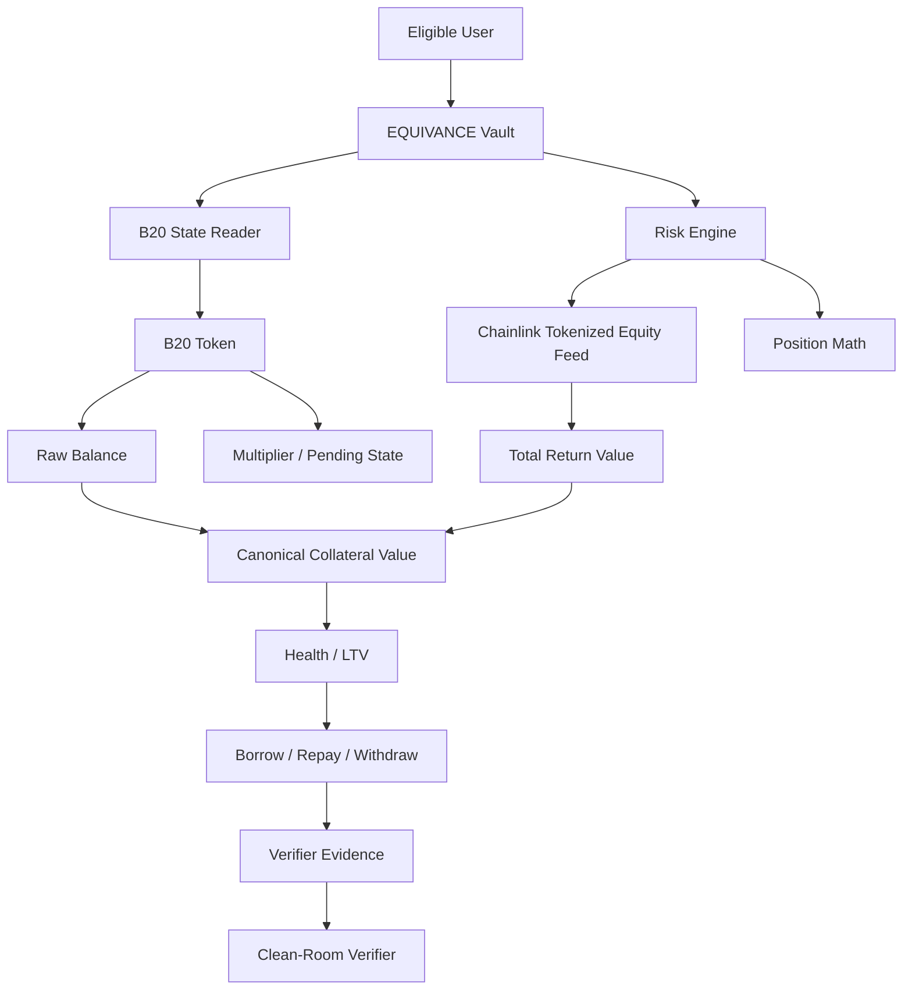
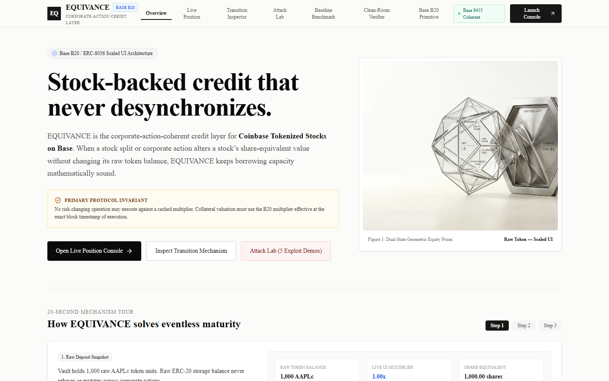
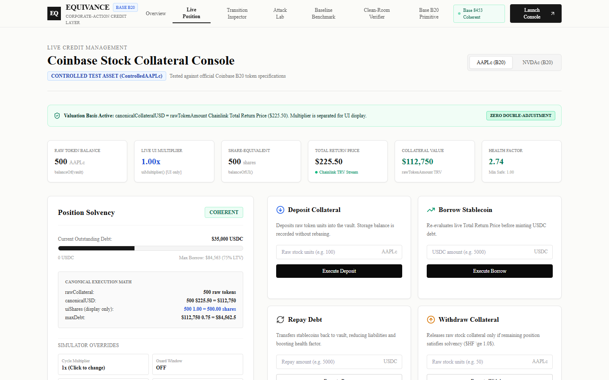
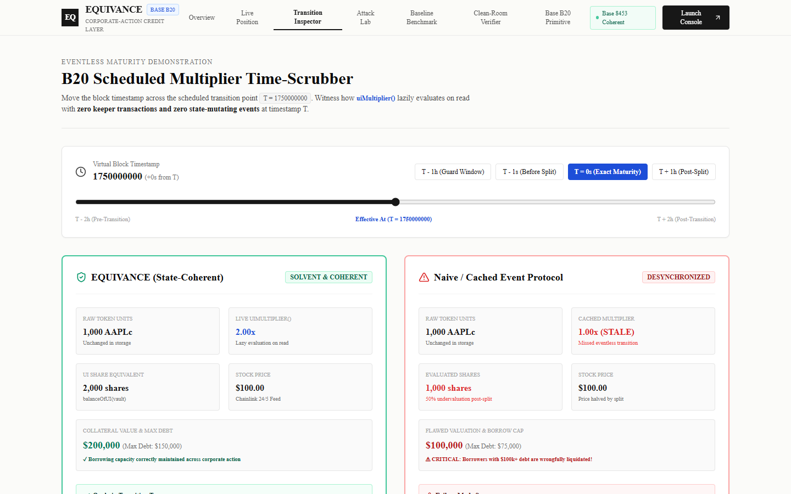
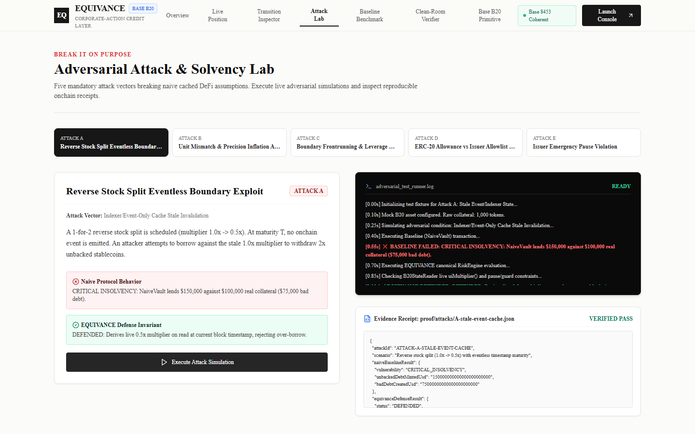
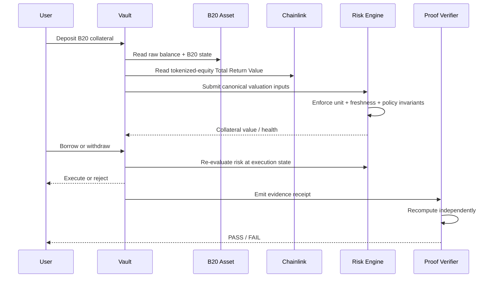

# EQUIVANCE


> **EQUIVANCE lets a Base credit market use Coinbase Tokenized Stocks without confusing raw token units, B20 share-equivalent units, and total-return oracle value.**


## The Problem

Coinbase Tokenized Stocks are B20 assets. Their raw ERC-20 balance is the canonical transferable quantity, while a B20 multiplier changes the asset's derived share-equivalent representation. Base's Coinbase tokenized-equity Chainlink feeds already incorporate that multiplier into the token's **Total Return Value**. That creates a subtle integration hazard:

```text
RAW BALANCE
    │
    ├──× B20 multiplier ──> UI / share-equivalent amount
    │
    └──× Chainlink TRV ───> USD economic value
```

The multiplier belongs in the first path. The total-return oracle already contains it in the second.

A credit protocol that multiplies the raw balance by the B20 multiplier **and then multiplies again by the total-return feed** can double-adjust a corporate action such as a split or dividend.

Base's B20 documentation explicitly separates raw balances from scaled UI values, while its Coinbase integration documentation says the Chainlink tokenized-equity feed already incorporates the multiplier. citehttps://github.com/base/base-std/blob/main/docs/B20/Asset.md citehttps://docs.chain.link/data-feeds/tokenized-equity-feeds/coinbase

## The EQUIVANCE Thesis

> **Because B20 exposes a derived multiplier while Coinbase's Chainlink tokenized-equity feed already embeds the same corporate-action adjustment, we can build credit infrastructure that proves valuation-unit consistency before allowing risk-changing actions.**

EQUIVANCE therefore treats valuation as a **unit-consistency problem**, not merely a price-read problem.

## The Core Invariant

```text
ONE ECONOMIC FACT
        ↓
ONE VALUATION BASIS
        ↓
ONE COLLATERAL VALUE
```

For Coinbase Tokenized Stocks:

```text
Collateral Value = rawTokenBalance × Chainlink Total Return Value
```

The B20 multiplier is read independently for share-equivalent reporting, corporate-action state, and consistency checks, but is **never multiplied into a total-return oracle price a second time**.

An equivalent decomposed valuation may be used only when the underlying reference price is used instead of the total-return token feed:

```text
rawTokenBalance × underlyingEquityPrice × B20Multiplier
```

The two paths are alternatives, never a compound formula.

## Product Links

| Resource | Description / Endpoint |
|---|---|
| **Live Web App** | [EQUIVANCE Protocol Studio](https://equivance.vercel.app) |
| **Demo Video** | [Watch on Youtube](https://youtu.be/owCtDoSX6uo?si=Dt7lfajBtDJrzAkr) |
| **Repository** | [github.com/0xkinno/equivance](https://github.com/0xkinno/equivance) |


## What We Built

EQUIVANCE is a Base-native collateral adapter and credit testbed with five tightly coupled components:

1. **B20 State Reader** — reads the asset's raw balance, multiplier, pending corporate-action state and policy state directly from the token.
2. **Risk Engine** — derives solvency from an explicit valuation basis, oracle freshness and asset policy state.
3. **Credit Vault** — performs deposit, borrow, repay and withdrawal against the verified collateral state.
4. **Adversarial Testbed** — attacks the exact classes of integration mistakes EQUIVANCE is designed to prevent.
5. **Clean-Room Verifier** — recomputes evidence independently from protocol outputs instead of trusting the protocol's own verdict.

## Architecture



## The Mechanism in One Picture

```text
                B20 TOKEN
             ┌──────────────┐
             │ raw balance  │──────────────┐
             │ multiplier   │───────┐      │
             │ pending CA   │       │      │
             └──────────────┘       │      │
                                    │      │
                                    ▼      ▼
                               UI/share     raw units
                               reporting       │
                                               │
                                               ▼
                                    Chainlink Total Return
                                               │
                                               ▼
                                      ECONOMIC VALUE
                                               │
                                               ▼
                                         RISK ENGINE
                                               │
                                   ┌───────────┴───────────┐
                                   ▼                       ▼
                                  LTV                 LIQUIDATION
```

## The Discovery

B20 deliberately keeps raw balances stable across corporate actions. Its multiplier changes the scaled representation instead of rewriting every balance. The Cobalt/ ERC-8056 path schedules multiplier changes at an `effectiveAt` timestamp and evaluates them lazily when read. citehttps://github.com/base/base-std/blob/main/docs/B20/Asset.md citehttps://github.com/base/base-std/blob/main/changelog/02_Cobalt_B20Asset_multiplier.md

Separately, Coinbase's Chainlink tokenized-equity feed reports a Total Return Value that already combines the underlying equity price with the multiplier. citehttps://docs.chain.link/data-feeds/tokenized-equity-feeds/coinbase

That creates the integration boundary EQUIVANCE is designed to make explicit:

```text
B20 multiplier
        ≠
another price adjustment
```

It is already reflected in the tokenized-equity total-return price.

## Why Existing Integrations Can Get This Wrong

A generic ERC-20 integration sees:

```text
balanceOf(user)
```

A B20-aware integration sees:

```text
balanceOf(user) × multiplier
```

A tokenized-equity oracle integration sees:

```text
Chainlink total-return price
```

The dangerous mistake is combining all three as though each represented an independent economic adjustment.

EQUIVANCE makes the valuation basis explicit and mechanically testable.

## Attack Lab

Every attack follows the same evidence chain:

```text
ATTACK
  ↓
FAULTY ASSUMPTION
  ↓
RISK ENGINE
  ↓
REJECT / CORRECT
  ↓
RECEIPT
  ↓
INDEPENDENT VERIFICATION
```

### Attack A — Double-Adjustment

A naive valuation path applies:

```text
raw × multiplier × total-return-price
```

EQUIVANCE rejects the compounded basis and uses the canonical raw-token × total-return valuation.

### Attack B — Raw/UI Unit Confusion

A caller attempts to use the scaled UI/share-equivalent amount where the protocol expects raw ERC-20 units.

The adapter keeps these units distinct and fails closed on an inconsistent conversion.

### Attack C — Corporate-Action Boundary

A scheduled multiplier crosses its `effectiveAt` timestamp without a maturity transaction.

EQUIVANCE reads the effective B20 state at execution time rather than relying on a cached event snapshot.

### Attack D — Policy / Allowance Desynchronization

A wallet appears spendable through a generic allowance check while B20 policy state blocks the transfer path.

EQUIVANCE validates the asset's actual transfer eligibility before the credit action.

### Attack E — Oracle Freshness / Pause

A feed is stale, held, or explicitly paused during a corporate-action process.

EQUIVANCE refuses a risk-changing action rather than presenting a frozen value as live market truth.

## Verification

The protocol is designed so that its most important claim can be checked without trusting the UI.

```bash
node verifier/verify-position.js proof/fixtures/valid_split_evidence.json
```

The verifier independently recomputes:

```text
raw balance
→ valuation basis
→ collateral value
→ debt
→ LTV
→ health factor
→ liquidation state
```

A valid proof returns `PASS`. Tampering with the evidence changes the recomputed result.

## Differential Fuzzing

The reference model is cross-checked against the implementation across thousands of generated states.

```text
5,000 scenarios
5,000 matches
0 desyncs
```

The important property is not the number of cases. It is that the same state transition is independently represented by two implementations.

See [`proof/differential_fuzz_report.json`](proof/differential_fuzz_report.json).

## Live Deployment

### Base Mainnet · Chain ID 8453

| Contract | Address |
|---|---|
| `EQUIVANCEVault` | [`0x43410D288dFA265A560eb7DfFCa2991fA687d78d`](https://basescan.org/address/0x43410D288dFA265A560eb7DfFCa2991fA687d78d) |
| `RiskEngine` | [`0x029192f49d95eD5B147cE7E6Fc18d01BDfb513c5`](https://basescan.org/address/0x029192f49d95eD5B147cE7E6Fc18d01BDfb513c5) |
| `B20StateReader` | [`0xFa34633c12e5A93166FAA0E54A3D50Fd62Ae8D49`](https://basescan.org/address/0xFa34633c12e5A93166FAA0E54A3D50Fd62Ae8D49) |
| `ControlledAAPLc` (CONTROLLED TEST ASSET) | [`0x7047D67Ef69F40F9340Fd97EDF79276458238cfe`](https://basescan.org/address/0x7047D67Ef69F40F9340Fd97EDF79276458238cfe) |
| `NaiveVault` (Baseline) | [`0xEE80113b73a2A91F325B7bec4071175369b70dE1`](https://basescan.org/address/0xEE80113b73a2A91F325B7bec4071175369b70dE1) |
| `Base USDC` (Native) | [`0x833589fCD6eDb6E08f4c7C32D4f71b54bdA02913`](https://basescan.org/token/0x833589fCD6eDb6E08f4c7C32D4f71b54bdA02913) |
| `Coinbase AAPL Total Return Feed` | [`0x787f13dEa48Db0897CbCDD985de77809D837F988`](https://basescan.org/address/0x787f13dEa48Db0897CbCDD985de77809D837F988) |

## What Is Real vs Controlled

| Asset / Infrastructure | Type & Verification Status |
|---|---|
| **Official Coinbase AAPLc Asset** (`0xb200000000000000000000C2e324d24d7eEcd1fb`) | **REAL OFFICIAL MAINNET ASSET** — Coinbase B20 tokenized stock backed 1:1 by Alpaca regulated custody under ADGM framework. Verified on Base registry. |
| **Official Chainlink AAPL/USD Feed** (`0x787f13dEa48Db0897CbCDD985de77809D837F988`) | **REAL OFFICIAL MAINNET FEED** — Chainlink 24/5 equity Total Return Value stream on Base (incorporates split/corporate actions). |
| **Native USDC on Base** (`0x833589fCD6eDb6E08f4c7C32D4f71b54bdA02913`) | **REAL OFFICIAL MAINNET STABLECOIN** — Circle native USDC on Base. |
| **`ControlledAAPLc`** (`0x7047D67Ef69F40F9340Fd97EDF79276458238cfe`) | **CONTROLLED TEST ASSET** — Deployed specifically for deterministic fault injection and adversarial split simulations. Not Coinbase-issued. |
| **`EQUIVANCEVault`** (`0x43410D288dFA265A560eb7DfFCa2991fA687d78d`) | **REAL ONCHAIN DEPLOYMENT** — Live production credit vault enforcing Valuation-Basis Integrity. |
| **`NaiveVault`** (`0xEE80113b73a2A91F325B7bec4071175369b70dE1`) | **REAL ONCHAIN DEPLOYMENT** — Baseline comparison contract demonstrating double corporate action overvaluation error. |

## Evidence Surface

| Artifact | Purpose |
|---|---|
| [`proof/mainnet_asset_attestation.json`](proof/mainnet_asset_attestation.json) | Official Base mainnet asset & oracle attestation |
| [`proof/fixtures/official_mainnet_evidence.json`](proof/fixtures/official_mainnet_evidence.json) | Verifier fixture from official mainnet state |
| [`proof/deployment_manifest.json`](proof/deployment_manifest.json) | Onchain deployment evidence |
| [`proof/differential_fuzz_report.json`](proof/differential_fuzz_report.json) | Differential model results (5,000 runs, 0 errors) |
| [`proof/attacks/`](proof/attacks/) | Adversarial evidence receipts (A through E) |
| [`verifier/`](verifier/) | Independent reference implementation |
| `task.md` | Build and release gate |
| `DISCOVERY.md` | Sponsor-primitive discovery record |
| `PROOF.md` | Judge-facing proof map |


## Product Screenshots

| Landing / Mechanism | Live Position |
|---|---|
|  |  |

| Transition Inspector | Attack Lab |
|---|---|
|  |  |

## Local Setup

```bash
# Install dependencies
npm install

# Run Hardhat test suite (25 passing tests across 12 suites)
npm test

# Run 5,000 differential fuzz iterations
node proof/differential_fuzz.js

# Verify cryptographic position proof
node verifier/verify-position.js proof/fixtures/valid_split_evidence.json

# Build & launch frontend application
npm run build
npm run start
```

## Documentation

- [`ARCHITECTURE.md`](ARCHITECTURE.md) — System architecture, fixed-point math, and component design.
- [`PROOF.md`](PROOF.md) — Valuation-basis integrity, eventless transition proofs, and mathematical models.
- [`EVIDENCE.md`](EVIDENCE.md) — Mainnet deployment manifest, attack receipts, and verification evidence.
- [`SECURITY.md`](SECURITY.md) — Threat model, adversarial vectors, and invariant verification table.
- [`DISCOVERY.md`](DISCOVERY.md) — Sponsor primitive discovery record and Base B20 specification analysis.
- [`THESIS.md`](THESIS.md) — Corporate-action-coherent credit thesis on Base.
- [`LIMITATIONS.md`](LIMITATIONS.md) — Operational boundaries, edge cases, and scope definitions.

## Explore in 2 Minutes

**0:00 — The problem**

Show a tokenized stock with both raw and scaled state.

**0:20 — The dangerous formula**

Show why multiplying B20 multiplier into an already total-return price is an over-adjustment.

**0:40 — EQUIVANCE valuation**

Deposit collateral and show the canonical raw-token × total-return path.

**1:00 — Break it**

Run the double-adjustment, unit-confusion and transition-boundary attacks.

**1:25 — Prove it**

Open the evidence receipt and run the clean-room verifier.

**1:45 — Mainnet proof**

Show the deployed contracts and BaseScan evidence.

## Product Flow



## Real-World Use

EQUIVANCE is intended as a reusable valuation and risk adapter for:

- lending markets accepting Coinbase Tokenized Stocks as collateral;
- structured-product vaults whose accounting spans B20 and Chainlink state;
- automated agents that need deterministic collateral checks;
- risk curators who need to prove why a position was accepted or rejected.

The key product is the **valuation discipline**, not the demo vault.

## Security Model

EQUIVANCE is fail-closed around the claims that matter most:

```text
invalid unit basis       → reject
stale oracle             → reject
paused asset policy      → reject
inconsistent state       → reject
unknown valuation path   → reject
```

The project does not claim that an oracle, issuer, custody arrangement, or legal structure is risk-free. It proves a narrower property: **the credit layer does not silently compound the same corporate-action adjustment twice.**

## Honest Status

The core mechanism, adversarial suite and deterministic verifier are implemented. Before public submission, the following release gate must pass against the final production code and official Coinbase-issued B20 address:

```text
[ ] Official asset address verified from Base registry
[ ] Official B20 interface support verified onchain
[ ] Chainlink total-return feed mapping verified onchain
[ ] Canonical valuation uses exactly one adjustment path
[ ] Mainnet attack receipts regenerated from final bytecode
[ ] Vercel live demo points to mainnet evidence
[ ] Demo URL is real
[ ] All README links resolve
```

## License

MIT

## Official References

- [Base: B20](https://github.com/base/base-std/tree/main/docs/B20)
- [Base: B20 Asset](https://github.com/base/base-std/blob/main/docs/B20/Asset.md)
- [Base: Cobalt scheduled multiplier](https://github.com/base/base-std/blob/main/changelog/02_Cobalt_B20Asset_multiplier.md)
- [Base Tokenized Stocks](https://www.base.org/stocks)
- [Chainlink: Coinbase Tokenized Equity Feeds](https://docs.chain.link/data-feeds/tokenized-equity-feeds/coinbase)
